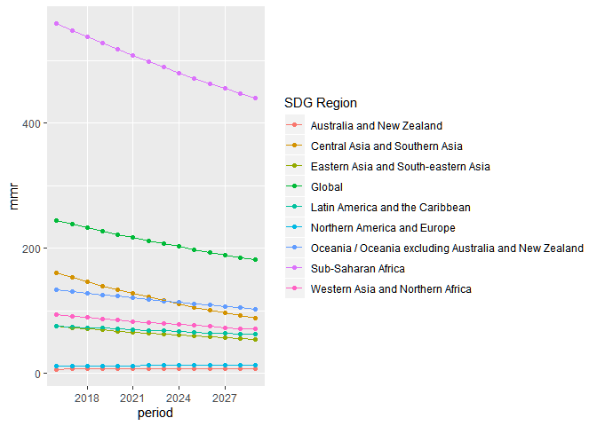
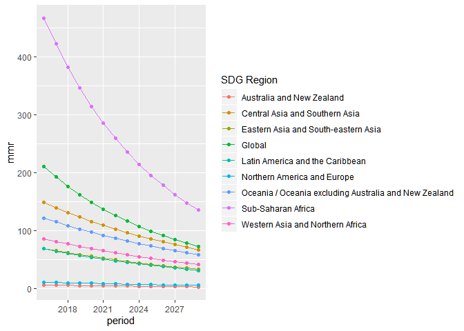

WHO MMR Final Package Write-Up
================
Li Shandross
5/5/2020

#### Description

This document serves as documentation for the package WHOmmr that aims
to help analyze the data collected by the World Health Organization
(WHO) on Maternal Mortality Ratio (MMR) around the world. WHO defines
MMR as “the number of maternal deaths per 100,000 live births.” WHOmmr
is a collection of functions that work on estimates of maternal
mortality between 2000 and 2017 (though we are focusing on 2010 to 2017)
to gain insight about the projected MMR for every country between 2016
and 2030. In particular, this package is meant to assist WHO in the
achieving the standard development goal (SDG) of a global MMR of 70 by
2030, with no single country having an MMR above 140, to reduce
inequality in this sector.

We compare MMR projections following the observed, Business As Usual
(BAU) trends with these SDG projections that WHO hopes to achieve. The
Average Rate of Reduction (ARR) is the average annual reduction in MMR a
particular country or region experiences, and this ARR is used to
calculate the desired projections.

Below, a description of each function is provided about its purpose and
an example is given for its implementation

#### Calc BAU ARR

Calculates the observed (BAU) ARR of each country based on the observed
ARR from time1 to time2.

**Base Equation:** ARR (for period t1 to t2) = -1/(t2 - t1) \*
log(MMR(t2) / MMR(t1))

**Tests**  
\- Check inputs (stop if inputs for arguments are not as expected), both
in terms of data type and in terms of if the numerical arguments are
within an acceptable range.  
\- Test to see if correct values are returned (using toy data) based on
base equation in function.

``` r
bau_arr_tibble <- calc_bau_arr(mmr_est_unrounded_pwider, 3, 10)
kable(bau_arr_tibble[1:5, ])
```

| iso |       arr |
| :-- | --------: |
| AFG | 0.0503407 |
| ALB | 0.0397664 |
| DZA | 0.0033535 |
| AGO | 0.0375549 |
| ATG | 0.0054979 |

#### MMR Projections (single country)

Calculates the MMR projections for one country during a specified period
using data from baseyear 2015 and the country’s respective ARR. The
single country is specified by using its assigned ISO code. (This
function can be used for any MMR projections when provided with an
tibble of ARRs for each country.)

**Base Equation:** MMR(t) = MMR(2015) \* exp(-ARR \* (t - 2015))

**Tests:**  
\- Check inputs (stop if inputs for arguments are not as expected), both
in terms of data type and in terms of if the numerical arguments are
within an acceptable range.  
\- Test to see if correct values are returned (using toy data) based on
base equation in function.

``` r
#BAU MMR Projections for Afghanistan
mmr_proj_single_country(mmr_est_unrounded_pwider, bau_arr_tibble, 2, "AFG", 2016, 2030) 
```

    ##  [1] 666.7393 634.0060 602.8798 573.2816 545.1366 518.3734 492.9240
    ##  [8] 468.7241 445.7123 423.8303 403.0225 383.2363 364.4215 346.5303
    ## [15] 329.5176

#### MMR Projections (all countries)

Calculates the MMR projections for all countries for a specified period
using data from baseyear 2015 and each country’s respective ARR. (This
function can be used for any MMR projections when provided with an
tibble of ARRs for each country.)

**Base Equation:** MMR(t) = MMR(2015) \* exp(-ARR \* (t - 2015))

**Tests:**  
\- Check inputs (stop if inputs for arguments are not as expected), both
in terms of data type and in terms of if the numerical arguments are
within an acceptable range.  
\- Test to see if correct values are returned (using toy data) based on
base equation in function.  
\- Check that this function’s call to mmr\_proj\_single\_country
produces the correct results.

``` r
#BAU Projections for all countries between 2016 and 2030
bau_mmr_proj <- mmr_proj_all_countries(mmr_est_unrounded_pwider, bau_arr_tibble, 2, 2016, 2030) 
kable(bau_mmr_proj[1:6, ])
```

|       | iso |      2016 |      2017 |      2018 |      2019 |      2020 |      2021 |      2022 |      2023 |      2024 |      2025 |       2026 |       2027 |       2028 |       2029 |       2030 |
| ----- | :-- | --------: | --------: | --------: | --------: | --------: | --------: | --------: | --------: | --------: | --------: | ---------: | ---------: | ---------: | ---------: | ---------: |
| col   | AFG | 666.73931 | 634.00602 | 602.87976 | 573.28164 | 545.13662 | 518.37336 | 492.92404 | 468.72414 | 445.71233 | 423.83027 | 403.022501 | 383.236281 | 364.421458 | 346.530340 | 329.517579 |
| col.1 | ALB |  14.38308 |  13.82234 |  13.28346 |  12.76559 |  12.26791 |  11.78963 |  11.33000 |  10.88828 |  10.46379 |  10.05585 |   9.663809 |   9.287054 |   8.924988 |   8.577037 |   8.242652 |
| col.2 | DZA | 113.18407 | 112.80514 | 112.42749 | 112.05109 | 111.67596 | 111.30208 | 110.92945 | 110.55807 | 110.18794 | 109.81904 | 109.451382 | 109.084951 | 108.719748 | 108.355767 | 107.993004 |
| col.3 | AGO | 241.62757 | 232.72156 | 224.14380 | 215.88221 | 207.92513 | 200.26133 | 192.88001 | 185.77075 | 178.92353 | 172.32869 | 165.976917 | 159.859266 | 153.967102 | 148.292113 | 142.826296 |
| col.4 | ATG |  43.07077 |  42.83462 |  42.59977 |  42.36620 |  42.13392 |  41.90291 |  41.67316 |  41.44467 |  41.21744 |  40.99145 |  40.766707 |  40.543191 |  40.320901 |  40.099829 |  39.879970 |
| col.5 | ARG |  40.07116 |  38.78246 |  37.53520 |  36.32805 |  35.15973 |  34.02897 |  32.93459 |  31.87540 |  30.85027 |  29.85812 |  28.897869 |  27.968502 |  27.069024 |  26.198473 |  25.355920 |

#### MMR Projections (by region)

1.  Produces a table of all the projected MMRs by SDG region for a
    specified period.  
2.  Produces a line graph of all the projected MMRs by SDG region.

These main two functions can be used for any MMR projections when
provided with an tibble of MMR projections for all countries. However,
note that the large, wrapper functions can only be used on data
formatted in exactly the same way as the WHO MMR data with the same
region definitions and names. Using the individual global and regional
prediction functions is suitable for data formatted slightly
differently.

**Base Equation:** MMR(region) = sum(region\_mmr\_proj \*
region\_total\_births) / sum(region\_total\_births)

**Tests:**  
\- Check inputs (stop if inputs for arguments are not as expected), both
in terms of data type and in terms of if the numerical arguments are
within an acceptable range.  
\- Test to see if the correct values are returned (using toy data) based
on base equation in the function.  
\- Check that this function’s call to the two helper functions produces
the correct results.

``` r
#Part 1: Table - BAU Regional Projections for 2016 to 2030
bau_regional_proj_summaries <- mmr_proj_all_regions(mmr_est_unrounded_pwider, bau_mmr_proj, countries_and_regions, births2030, 2016, 2030)
knitr::kable(bau_regional_proj_summaries)
```

| SDG Region                                            |       2016 |      2017 |       2018 |       2019 |      2020 |       2021 |       2022 |       2023 |       2024 |       2025 |      2026 |       2027 |       2028 |       2029 |     2030 |
| :---------------------------------------------------- | ---------: | --------: | ---------: | ---------: | --------: | ---------: | ---------: | ---------: | ---------: | ---------: | --------: | ---------: | ---------: | ---------: | -------: |
| Global                                                | 238.756292 | 233.04428 | 227.528871 | 222.202327 | 217.05726 | 212.086590 | 207.283548 | 202.641649 | 198.154688 | 193.816723 | 189.62207 | 185.565270 | 181.641119 | 177.844619 | 422.2285 |
| Australia and New Zealand                             |   7.091376 |   7.17193 |   7.255895 |   7.343299 |   7.43417 |   7.528541 |   7.626444 |   7.727913 |   7.832985 |   7.941697 |   8.05409 |   8.170206 |   8.290087 |   8.413778 | 118.7505 |
| Central Asia and Southern Asia                        | 153.551874 | 146.62050 | 140.005517 | 133.692351 | 127.66710 | 121.916517 | 116.427960 | 111.189381 | 106.189292 | 101.416735 |  96.86126 |  92.512911 |  88.362177 |  84.399999 | 374.4367 |
| Eastern Asia and South-eastern Asia                   |  73.533476 |  71.60739 |  69.739278 |  67.927218 |  66.16937 |  64.463948 |  62.809245 |  61.203606 |  59.645435 |  58.133195 |  56.66540 |  55.240623 |  53.857478 |  52.514635 | 293.2474 |
| Latin America and the Caribbean                       |  74.799881 |  73.58594 |  72.409649 |  71.269710 |  70.16486 |  69.093880 |  68.055611 |  67.048929 |  66.072754 |  65.126047 |  64.20781 |  63.317084 |  62.452940 |  61.614491 | 300.5794 |
| Northern America and Europe                           |  12.529393 |  12.54521 |  12.575498 |  12.620086 |  12.67882 |  12.751568 |  12.838221 |  12.938689 |  13.052903 |  13.180811 |  13.32238 |  13.477609 |  13.646492 |  13.829057 | 621.2158 |
| Oceania / Oceania excluding Australia and New Zealand | 130.829910 | 128.24616 | 125.716661 | 123.240154 | 120.81543 | 118.441301 | 116.116619 | 113.840258 | 111.611123 | 109.428147 | 107.29029 | 105.196534 | 103.145894 | 101.137405 | 541.9159 |
| Sub-Saharan Africa                                    | 547.887395 | 537.40401 | 527.214663 | 517.309113 | 507.67754 | 498.310511 | 489.198953 | 480.334156 | 471.707746 | 463.311676 | 455.13821 | 447.179911 | 439.429627 | 431.880484 | 464.9395 |
| Western Asia and Northern Africa                      |  91.678797 |  89.50830 |  87.425798 |  85.428249 |  83.51274 |  81.676482 |  79.916789 |  78.231093 |  76.616929 |  75.071933 |  73.59384 |  72.180481 |  70.829774 |  69.539727 | 624.7521 |

``` r
#Part 2: Graph - BAU Regional Projections for 2016 to 2030
mmr_proj_all_regions_graph(mmr_est_unrounded_pwider, bau_mmr_proj, countries_and_regions, births2030, 2016, 2030)
```

<!-- -->

#### Get ARR SDG Target

Calculates the target ARR needed to achieve WHO’s SDG goal of a global
MMR of 70, with no country with an MMR above 140, by 2030.

**Base Equation:** N/A, R minimizes the results of the squared\_diff
function which calls get\_mmr\_sdg\_proj

**Tests:**  
\- Check inputs (stop if inputs for arguments are not as expected), both
in terms of data type and in terms of if the numerical arguments are
within an acceptable range.  
\- Test to see if correct values are returned (using toy data) based on
base equation in the function.  
\- Check that this function’s call to its inner function, squared\_diff
(and thus get\_mmr\_sdg\_proj, as well) produces the correct results.

``` r
get_arr_sdg_target(mmr2015, births, 15)
```

    ## $minimum
    ## [1] 0.05603232
    ## 
    ## $objective
    ## [1] 6.010324e-05

#### Calculate SDG ARR for each country Based on SDG MMR

Calculates the specific ARR for each country needed to achieve WHO’s SDG
goal of a global MMR of 70, with no country with an MMR above 140, by
2030. Each country-specific ARR is based on the single target SDG ARR
calculated.

**Base Equation:** -1/nproject \*
log(mmr\_sdg\_projections\_using\_sdg\_arr/2015\_mmr\_all\_countries)

**Tests:**  
\- Check inputs (stop if inputs for arguments are not as expected), both
in terms of data type and in terms of if the numerical arguments are
within an acceptable range.  
\- Test to see if correct values are returned (using toy data) based on
base equation in the function.  
\- Check that this function’s call to get\_mmr\_sdg\_proj and
get\_arr\_sdg\_proj (and thus squared\_diff, as well) produces the
correct
results.

``` r
sdg_arr_tibble <- calc_sdg_arr(mmr_est_unrounded_pwider, sdg_arr_target, mmr2015, births, 15)
kable(sdg_arr_tibble[1:5, ])
```

| iso |  sdg\_arr |
| :-- | --------: |
| AFG | 0.1074065 |
| ALB | 0.0560323 |
| DZA | 0.0560323 |
| AGO | 0.0560323 |
| ATG | 0.0560323 |

#### SDG MMR Projections

These are calculated by the general mmr\_proj\_all\_countries,
mmr\_proj\_all\_regions, and mmr\_proj\_all\_regions\_graph,
respectively. See above for more details.

**SDG MMR Projections for 2016 to
2030**

``` r
sdg_mmr_proj <- mmr_proj_all_countries(mmr_est_unrounded_pwider, sdg_arr_tibble, 2, 2016, 2030) 
kable(sdg_mmr_proj[1:6, ])
```

|       | iso |      2016 |      2017 |      2018 |      2019 |      2020 |      2021 |      2022 |       2023 |       2024 |       2025 |       2026 |       2027 |       2028 |       2029 |       2030 |
| ----- | :-- | --------: | --------: | --------: | --------: | --------: | --------: | --------: | ---------: | ---------: | ---------: | ---------: | ---------: | ---------: | ---------: | ---------: |
| col   | AFG | 629.75655 | 565.62246 | 508.01975 | 456.28327 | 409.81562 | 368.08020 | 330.59510 | 296.927460 | 266.688517 | 239.529093 | 215.135571 | 193.226272 | 173.548206 | 155.874144 | 140.000000 |
| col.1 | ALB |  14.15102 |  13.37991 |  12.65082 |  11.96146 |  11.30966 |  10.69338 |  10.11068 |   9.559737 |   9.038814 |   8.546276 |   8.080577 |   7.640255 |   7.223927 |   6.830285 |   6.458093 |
| col.2 | DZA | 107.37599 | 101.52492 |  95.99268 |  90.76191 |  85.81616 |  81.13992 |  76.71849 |  72.537988 |  68.585290 |  64.847980 |  61.314321 |  57.973216 |  54.814173 |  51.827271 |  49.003130 |
| col.3 | AGO | 237.20391 | 224.27833 | 212.05709 | 200.50180 | 189.57617 | 179.24589 | 169.47853 | 160.243403 | 151.511513 | 143.255435 | 135.449242 | 128.068421 | 121.089790 | 114.491435 | 108.252634 |
| col.4 | ATG |  40.94830 |  38.71696 |  36.60722 |  34.61244 |  32.72636 |  30.94306 |  29.25692 |  27.662673 |  26.155294 |  24.730055 |  23.382479 |  22.108335 |  20.903620 |  19.764552 |  18.687554 |
| col.5 | ARG |  39.14660 |  37.01344 |  34.99653 |  33.08952 |  31.28642 |  29.58158 |  27.96964 |  26.445532 |  25.004478 |  23.641948 |  22.353665 |  21.135582 |  19.983874 |  18.894924 |  17.865313 |

**SDG MMR Regional Projections**

``` r
#Part 1: Table - SDG Regional Projections for 2016 to 2030
sdg_regional_proj_summaries <- mmr_proj_all_regions(mmr_est_unrounded_pwider, sdg_mmr_proj, countries_and_regions, births2030, 2016, 2030)
knitr::kable(sdg_regional_proj_summaries)
```

| SDG Region                                            |      2016 |       2017 |       2018 |       2019 |       2020 |       2021 |       2022 |       2023 |       2024 |       2025 |       2026 |       2027 |       2028 |       2029 |     2030 |
| :---------------------------------------------------- | --------: | ---------: | ---------: | ---------: | ---------: | ---------: | ---------: | ---------: | ---------: | ---------: | ---------: | ---------: | ---------: | ---------: | -------: |
| Global                                                | 210.10812 | 192.565454 | 176.642628 | 162.177178 | 149.023954 | 137.053193 | 126.148824 | 116.206947 | 107.134505 |  98.848092 |  91.272900 |  84.341790 |  77.994459 |  72.176707 | 422.2285 |
| Australia and New Zealand                             |   6.20462 |   5.866522 |   5.546847 |   5.244591 |   4.958806 |   4.688593 |   4.433105 |   4.191539 |   3.963136 |   3.747179 |   3.542990 |   3.349928 |   3.167385 |   2.994790 | 118.7505 |
| Central Asia and Southern Asia                        | 148.50211 | 139.505084 | 131.090476 | 123.217165 | 115.847225 | 108.945656 | 102.480135 |  96.420795 |  90.740015 |  85.412242 |  80.413813 |  75.722809 |  71.318906 |  67.183256 | 374.4367 |
| Eastern Asia and South-eastern Asia                   |  69.34435 |  65.565681 |  61.992914 |  58.614832 |  55.420826 |  52.400867 |  49.545469 |  46.845666 |  44.292979 |  41.879392 |  39.597324 |  37.439610 |  35.399472 |  33.470504 | 293.2474 |
| Latin America and the Caribbean                       |  68.52786 |  64.512960 |  60.739280 |  57.191880 |  53.856777 |  50.720887 |  47.771955 |  44.998510 |  42.389805 |  39.935777 |  37.626994 |  35.454622 |  33.410380 |  31.486506 | 300.5794 |
| Northern America and Europe                           |  11.21238 |  10.601398 |  10.023713 |   9.477507 |   8.961064 |   8.472763 |   8.011070 |   7.574535 |   7.161788 |   6.771532 |   6.402542 |   6.053658 |   5.723786 |   5.411888 | 621.2158 |
| Oceania / Oceania excluding Australia and New Zealand | 121.72992 | 115.096685 | 108.824903 | 102.894879 |  97.287991 |  91.986630 |  86.974148 |  82.234803 |  77.753711 |  73.516801 |  69.510766 |  65.723026 |  62.141684 |  58.755496 | 541.9159 |
| Sub-Saharan Africa                                    | 465.94836 | 421.811415 | 382.129313 | 346.429297 | 314.290712 | 285.339099 | 259.240977 | 235.699222 | 214.448984 | 195.254066 | 177.903725 | 162.209832 | 148.004368 | 135.137189 | 464.9395 |
| Western Asia and Northern Africa                      |  86.08782 |  81.396769 |  76.961343 |  72.767610 |  68.802400 |  65.053259 |  61.508415 |  58.156734 |  54.987690 |  51.991333 |  49.158251 |  46.479548 |  43.946812 |  41.552087 | 624.7521 |

``` r
#Part 2: Graph - SDG Regional Projections for 2016 to 2030
mmr_proj_all_regions_graph(mmr_est_unrounded_pwider, sdg_mmr_proj, countries_and_regions, births2030, 2016, 2030)
```

<!-- -->
