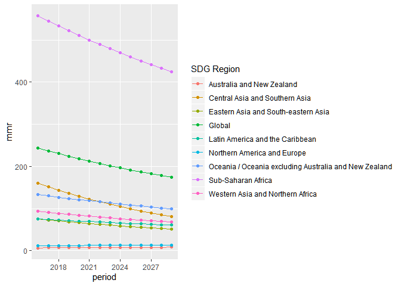

WHO MMR MD 4\_24\_20
================
Li Shandross
4/24/2020

This document serves as documentation for the package WHOmmr that aims
to help analyze the data collected by the World Health Organization
(WHO) on Maternal Mortality Ratio (MMR) around the world. WHO defines
MMR as “the number of maternal deaths per 100,000 live births.” WHOmmr
is a collection of functions that work on estimates of maternal
mortality between 2000 and 2017 (though we are focusing on 2010 to 2017)
to gain insight about the projected MMR for every country between 2016
and 2030. In particular, this package is meant to assist WHO in the
achieving the standard development goal (SDG) of a global MMR of 70 by
2030, with no single country having an MMR above 140, to reduce
inequality in this sector.

We compare MMR projections following the observed, Business As Usual
(BAU) trends with these SDG projections that WHO hopes to achieve. The
Average Rate of Reduction (ARR) is the average annual reduction in MMR a
particular country or region experiences, and this ARR is used to
calculate the desired projections.

Each function below has more information about its purpose.

\#Read-in Data

``` r
library(tidyr)
library(tidyverse)
```

    ## -- Attaching packages ------------------------------------------------------------ tidyverse 1.2.1 --

    ## v ggplot2 3.2.1     v purrr   0.3.2
    ## v tibble  2.1.3     v dplyr   0.8.3
    ## v readr   1.3.1     v stringr 1.4.0
    ## v ggplot2 3.2.1     v forcats 0.4.0

    ## -- Conflicts --------------------------------------------------------------- tidyverse_conflicts() --
    ## x dplyr::filter() masks stats::filter()
    ## x dplyr::lag()    masks stats::lag()

``` r
library(readxl)
library(dplyr)
library(devtools)
```

    ## Loading required package: usethis

``` r
library(usethis)
library(knitr)

load_all("WHOmmr")
```

    ## Loading WHOmmr

``` r
# Rfiles <- list.files(file.path(paste0(getwd(),"/R/")), ".R")
# Rfiles <- Rfiles[grepl(".R", Rfiles)]
# sapply(paste0(paste0(getwd(),"/R/"), Rfiles), source)

country_info <- read_excel("country list_ 26 March 2019.xlsx")
mmr_est_unrounded <- read.csv("mmr_unrounded.csv")
live_birth_projections <- read_excel("wpp2019_Births-TFR-GFR-Female1549.xlsx")
regional_groupings <- read.csv("regional_groupings_20190910_la_ac.csv")
```

\#Data Cleaning

``` r
country_info <- country_info %>%
  select(`Code`, `ISO_Numeric_Code_CODE`, `Title`) %>%
  rename(ISOCode = `Code`, ISONum = `ISO_Numeric_Code_CODE`)
  
mmr_est_unrounded <- mmr_est_unrounded %>%
  filter(`bound` == "point", `year` >= 2010) %>%
  select(-c(`q`, `perc`, `bound`)) %>%
  mutate("MMR" = `value` * 100000)

mmr_est_unrounded_pwider <- mmr_est_unrounded %>%
  select(-c(`value`)) %>%
  pivot_wider(names_from = `year`, values_from = `MMR`)
  
regional_groupings <- regional_groupings %>%
  select(`ISOCode`, `Country.x`, `sdg_1`)

live_birth_projections2030 <- live_birth_projections %>% 
  filter(Year == 2030) %>%
  select(-c(`Year`)) %>%
  rename(name = 'Location') 
```

\#Calc BAU ARR Calculates the observed (BAU) ARR of each country based
on the observed ARR from time1 to time2. Base Equation: ARR (for period
t1 to t2) = -1/(t2-t1)\*log(MMR(t2)/MMR(t1))

``` r
calc_bau_arr_tibble <- calc_bau_arr(mmr_est_unrounded_pwider, 3, 10)
kable(calc_bau_arr_tibble[1:5, ])
```

| iso |       arr |
| :-- | --------: |
| AFG | 0.0575322 |
| ALB | 0.0454474 |
| DZA | 0.0038326 |
| AGO | 0.0429199 |
| ATG | 0.0062833 |

\#MMR Projections (for one country) Calculates the MMR projections for
one country for a specified period using data from baseyear 2015 and the
country’s respective BAU ARR. The single country is specified by using
its assigned ISO code.  
Base Equation: MMR(t) = MMR(2015)*exp(-ARR *
(t-2015))

``` r
bau_mmr_single_country_proj(mmr_est_unrounded_pwider, "AFG", 3, 10, 2016, 2030)
```

    ##  [1] 661.9616 624.9523 590.0122 557.0255 525.8830 496.4817 468.7241
    ##  [8] 442.5185 417.7779 394.4206 372.3691 351.5505 331.8959 313.3401
    ## [15] 295.8217

\#MMR Projections (all countries) Calculates the MMR projections for all
countries for a specified period using data from baseyear 2015 and each
country’s respective BAU ARR. Base Equation: MMR(t) = MMR(2015)*exp(-ARR
*
(t-2015))

``` r
bau_mmr_proj_tibble <- bau_mmr_all_countries_proj(mmr_est_unrounded_pwider,3, 10, 2016, 2030)
kable(bau_mmr_proj_tibble[1:6, ])
```

|       | iso | name                |      2016 |      2017 |      2018 |      2019 |      2020 |      2021 |      2022 |      2023 |       2024 |       2025 |       2026 |       2027 |       2028 |       2029 |       2030 |
| ----- | :-- | :------------------ | --------: | --------: | --------: | --------: | --------: | --------: | --------: | --------: | ---------: | ---------: | ---------: | ---------: | ---------: | ---------: | ---------: |
| col   | AFG | Afghanistan         | 661.96164 | 624.95235 | 590.01220 | 557.02549 | 525.88303 | 496.48169 | 468.72414 | 442.51848 | 417.777928 | 394.420587 | 372.369121 | 351.550519 | 331.895854 | 313.340052 | 295.821677 |
| col.1 | ALB | Albania             |  14.30160 |  13.66618 |  13.05899 |  12.47878 |  11.92434 |  11.39454 |  10.88828 |  10.40451 |   9.942241 |   9.500507 |   9.078398 |   8.675044 |   8.289611 |   7.921302 |   7.569358 |
| col.2 | DZA | Algeria             | 113.12986 | 112.69711 | 112.26602 | 111.83658 | 111.40877 | 110.98261 | 110.55807 | 110.13516 | 109.713871 | 109.294190 | 108.876114 | 108.459637 | 108.044753 | 107.631457 | 107.219741 |
| col.3 | AGO | Angola              | 240.33472 | 230.23781 | 220.56510 | 211.29875 | 202.42170 | 193.91759 | 185.77075 | 177.96618 | 170.489489 | 163.326910 | 156.465245 | 149.891850 | 143.594616 | 137.561941 | 131.782709 |
| col.4 | ATG | Antigua and Barbuda |  43.03696 |  42.76739 |  42.49951 |  42.23331 |  41.96878 |  41.70590 |  41.44467 |  41.18508 |  40.927115 |  40.670764 |  40.416019 |  40.162869 |  39.911305 |  39.661316 |  39.412894 |
| col.5 | ARG | Argentina           |  39.88447 |  38.42193 |  37.01301 |  35.65576 |  34.34828 |  33.08875 |  31.87540 |  30.70654 |  29.580550 |  28.495846 |  27.450917 |  26.444305 |  25.474605 |  24.540464 |  23.640577 |

\#SDG MMR Calculation, Categorization, and Adjustment Calculates the MMR
projections for all using a fixed value of the ARR for a single year t
\> 2015 using baseyear 2015, then adjusts the projections to be less
than or equal to 140, as specified by the WHO’s SDG. Base Equation:
MMR(t) = MMR(2015)*exp(-ARR * (t-2015)) For countries with
mmr\_target2030 \> 140, replace mmr\_target by 140, mmr\_target\_final =
ifelse(mmr\_target2030 \> 140, 140, mmr\_target)

``` r
global_arr <- mean(calc_bau_arr(mmr_est_unrounded_pwider, 3, 10)$`arr`)

mmr2015 <- mmr_est_unrounded_pwider %>% 
  rename(MMR2015 = `2015`) %>%
  select(`MMR2015`)

mmr_sdg_proj <- data.frame(get_mmr_sdg_proj(mmr2015, global_arr, 15))
#make data.frame in function instead?
kable(mmr_sdg_proj[1:5, ])
```

|          x |
| ---------: |
| 140.000000 |
|   9.937566 |
|  75.404901 |
| 140.000000 |
|  28.755982 |

\#Squared Diff Calculates the squared difference
    of…

``` r
squared_diff(global_arr, mmr2015, live_birth_projections2030, 15)
```

    ## Warning: Column `name` joining character vector and factor, coercing into
    ## character vector

    ## [1] 257.1634

\#Get ARR SDG
    Target

``` r
get_arr_sdg_target(mmr2015, live_birth_projections2030, nproject = 15)
```

    ## Warning: Column `name` joining character vector and factor, coercing into
    ## character vector
    
    ## Warning: Column `name` joining character vector and factor, coercing into
    ## character vector
    
    ## Warning: Column `name` joining character vector and factor, coercing into
    ## character vector
    
    ## Warning: Column `name` joining character vector and factor, coercing into
    ## character vector
    
    ## Warning: Column `name` joining character vector and factor, coercing into
    ## character vector
    
    ## Warning: Column `name` joining character vector and factor, coercing into
    ## character vector
    
    ## Warning: Column `name` joining character vector and factor, coercing into
    ## character vector
    
    ## Warning: Column `name` joining character vector and factor, coercing into
    ## character vector
    
    ## Warning: Column `name` joining character vector and factor, coercing into
    ## character vector
    
    ## Warning: Column `name` joining character vector and factor, coercing into
    ## character vector
    
    ## Warning: Column `name` joining character vector and factor, coercing into
    ## character vector
    
    ## Warning: Column `name` joining character vector and factor, coercing into
    ## character vector
    
    ## Warning: Column `name` joining character vector and factor, coercing into
    ## character vector
    
    ## Warning: Column `name` joining character vector and factor, coercing into
    ## character vector

    ## $minimum
    ## [1] 0.05603232
    ## 
    ## $objective
    ## [1] 6.010324e-05

``` r
sdg_arr <- get_arr_sdg_target(mmr2015, live_birth_projections2030, nproject = 15)$minimum
```

    ## Warning: Column `name` joining character vector and factor, coercing into
    ## character vector
    
    ## Warning: Column `name` joining character vector and factor, coercing into
    ## character vector
    
    ## Warning: Column `name` joining character vector and factor, coercing into
    ## character vector
    
    ## Warning: Column `name` joining character vector and factor, coercing into
    ## character vector
    
    ## Warning: Column `name` joining character vector and factor, coercing into
    ## character vector
    
    ## Warning: Column `name` joining character vector and factor, coercing into
    ## character vector
    
    ## Warning: Column `name` joining character vector and factor, coercing into
    ## character vector
    
    ## Warning: Column `name` joining character vector and factor, coercing into
    ## character vector
    
    ## Warning: Column `name` joining character vector and factor, coercing into
    ## character vector
    
    ## Warning: Column `name` joining character vector and factor, coercing into
    ## character vector
    
    ## Warning: Column `name` joining character vector and factor, coercing into
    ## character vector
    
    ## Warning: Column `name` joining character vector and factor, coercing into
    ## character vector
    
    ## Warning: Column `name` joining character vector and factor, coercing into
    ## character vector
    
    ## Warning: Column `name` joining character vector and factor, coercing into
    ## character vector

\#Calculate SDG ARR for each country Based on SDG MMR \#From Pseudo
Code

``` r
arr_sdg_target_country <- calc_sdg_arr(mmr_est_unrounded_pwider, mmr2015, live_birth_projections2030, 15)
```

    ## Warning: Column `name` joining character vector and factor, coercing into
    ## character vector
    
    ## Warning: Column `name` joining character vector and factor, coercing into
    ## character vector
    
    ## Warning: Column `name` joining character vector and factor, coercing into
    ## character vector
    
    ## Warning: Column `name` joining character vector and factor, coercing into
    ## character vector
    
    ## Warning: Column `name` joining character vector and factor, coercing into
    ## character vector
    
    ## Warning: Column `name` joining character vector and factor, coercing into
    ## character vector
    
    ## Warning: Column `name` joining character vector and factor, coercing into
    ## character vector
    
    ## Warning: Column `name` joining character vector and factor, coercing into
    ## character vector
    
    ## Warning: Column `name` joining character vector and factor, coercing into
    ## character vector
    
    ## Warning: Column `name` joining character vector and factor, coercing into
    ## character vector
    
    ## Warning: Column `name` joining character vector and factor, coercing into
    ## character vector
    
    ## Warning: Column `name` joining character vector and factor, coercing into
    ## character vector
    
    ## Warning: Column `name` joining character vector and factor, coercing into
    ## character vector
    
    ## Warning: Column `name` joining character vector and factor, coercing into
    ## character vector

``` r
kable(arr_sdg_target_country[1:5, ])
```

| iso |  sdg\_arr |
| :-- | --------: |
| AFG | 0.1074065 |
| ALB | 0.0560323 |
| DZA | 0.0560323 |
| AGO | 0.0560323 |
| ATG | 0.0560323 |

\#(BAU) MMR Regional Summaries 1) Produces a table of all the projected
BAU MMRs by SDG region for a specified period. 2) Produces a line graph
of all the projected BAU MMRs by SDG region.

``` r
#some data cleaning
countries_and_regions <- country_info %>% 
  left_join(regional_groupings, by = c("ISOCode" = "ISOCode")) %>%
  select(-c(`Country.x`)) 
```

    ## Warning: Column `ISOCode` joining character vector and factor, coercing
    ## into character vector

``` r
#example
regional_proj_summaries <- bau_mmr_regional_projection_summaries(mmr_est_unrounded_pwider, countries_and_regions, live_birth_projections2030, 3, 10, 2016, 2030)
```

    ## Warning: Column `iso`/`ISOCode` joining factor and character vector,
    ## coercing into character vector

    ## Warning: Column `iso`/`ISOCode` joining factor and character vector,
    ## coercing into character vector
    
    ## Warning: Column `iso`/`ISOCode` joining factor and character vector,
    ## coercing into character vector
    
    ## Warning: Column `iso`/`ISOCode` joining factor and character vector,
    ## coercing into character vector
    
    ## Warning: Column `iso`/`ISOCode` joining factor and character vector,
    ## coercing into character vector
    
    ## Warning: Column `iso`/`ISOCode` joining factor and character vector,
    ## coercing into character vector
    
    ## Warning: Column `iso`/`ISOCode` joining factor and character vector,
    ## coercing into character vector
    
    ## Warning: Column `iso`/`ISOCode` joining factor and character vector,
    ## coercing into character vector
    
    ## Warning: Column `iso`/`ISOCode` joining factor and character vector,
    ## coercing into character vector

``` r
knitr::kable(regional_proj_summaries)
```

| SDG Region                                            |       2016 |       2017 |       2018 |       2019 |       2020 |       2021 |       2022 |       2023 |       2024 |       2025 |       2026 |       2027 |       2028 |       2029 |       2030 |
| :---------------------------------------------------- | ---------: | ---------: | ---------: | ---------: | ---------: | ---------: | ---------: | ---------: | ---------: | ---------: | ---------: | ---------: | ---------: | ---------: | ---------: |
| Global                                                | 243.814883 | 237.103765 | 230.656921 | 224.462487 | 218.509179 | 212.786268 | 207.283548 | 201.991310 | 196.900320 | 192.001788 | 187.287356 | 182.749065 | 178.379344 | 174.170986 | 170.117132 |
| Australia and New Zealand                             |   7.025024 |   7.114045 |   7.207496 |   7.305417 |   7.407852 |   7.514844 |   7.626444 |   7.742701 |   7.863672 |   7.989413 |   8.119984 |   8.255448 |   8.395873 |   8.541327 |   8.691883 |
| Central Asia and Southern Asia                        | 159.756448 | 151.538318 | 143.747630 | 136.361943 | 129.360007 | 122.721698 | 116.427960 | 110.460742 | 104.802953 |  99.438400 |  94.351748 |  89.528472 |  84.954813 |  80.617735 |  76.504891 |
| Eastern Asia and South-eastern Asia                   |  75.232046 |  72.977137 |  70.799787 |  68.697071 |  66.666183 |  64.704435 |  62.809245 |  60.978140 |  59.208745 |  57.498782 |  55.846064 |  54.248493 |  52.704051 |  51.210806 |  49.766897 |
| Latin America and the Caribbean                       |  75.871411 |  74.449118 |  73.077279 |  71.753886 |  70.477021 |  69.244848 |  68.055611 |  66.907632 |  65.799304 |  64.729088 |  63.695516 |  62.697178 |  61.732729 |  60.800879 |  59.900394 |
| Northern America and Europe                           |  12.527506 |  12.532424 |  12.556428 |  12.599236 |  12.660604 |  12.740322 |  12.838221 |  12.954165 |  13.088052 |  13.239813 |  13.409412 |  13.596845 |  13.802138 |  14.025347 |  14.266560 |
| Oceania / Oceania excluding Australia and New Zealand | 133.088692 | 130.086088 | 127.155523 | 124.295103 | 121.502993 | 118.777409 | 116.116619 | 113.518944 | 110.982752 | 108.506457 | 106.088521 | 103.727448 | 101.421787 |  99.170126 |  96.971095 |
| Sub-Saharan Africa                                    | 557.115234 | 544.861528 | 533.001751 | 521.520237 | 510.402020 | 499.632809 | 489.198953 | 479.087407 | 469.285708 | 459.781944 | 450.564728 | 441.623174 | 432.946872 | 424.525867 | 416.350636 |
| Western Asia and Northern Africa                      |  93.611651 |  91.049495 |  88.605206 |  86.274129 |  84.051823 |  81.934056 |  79.916789 |  77.996175 |  76.168544 |  74.430401 |  72.778415 |  71.209415 |  69.720379 |  68.308433 |  66.970840 |

``` r
#Graphical Representation
bau_mmr_regional_global_graph(mmr_est_unrounded_pwider, countries_and_regions, live_birth_projections2030, 3, 10, 2016, 2030)
```

    ## Warning: Column `iso`/`ISOCode` joining factor and character vector,
    ## coercing into character vector
    
    ## Warning: Column `iso`/`ISOCode` joining factor and character vector,
    ## coercing into character vector
    
    ## Warning: Column `iso`/`ISOCode` joining factor and character vector,
    ## coercing into character vector
    
    ## Warning: Column `iso`/`ISOCode` joining factor and character vector,
    ## coercing into character vector
    
    ## Warning: Column `iso`/`ISOCode` joining factor and character vector,
    ## coercing into character vector
    
    ## Warning: Column `iso`/`ISOCode` joining factor and character vector,
    ## coercing into character vector
    
    ## Warning: Column `iso`/`ISOCode` joining factor and character vector,
    ## coercing into character vector
    
    ## Warning: Column `iso`/`ISOCode` joining factor and character vector,
    ## coercing into character vector
    
    ## Warning: Column `iso`/`ISOCode` joining factor and character vector,
    ## coercing into character vector

<!-- -->

\#SDG MMR Projections

``` r
##TOFIX

arr_tibble <- cbind(calc_bau_arr(mmr_est_unrounded_pwider, 3, 10), calc_sdg_arr(mmr_est_unrounded_pwider, mmr2015, live_birth_projections2030, 15)# %>%
  #rename(`sdg arr` = MMR2015, `bau arr` = arr)
  )

#sdg_mmr_single_country_proj(mmr_est_unrounded_pwider, arr_tibble, "AFG", 2016, 2030)

 # years <- seq(mmr_start_year, mmr_end_year)
sdg_mmr_proj <- sdg_mmr_allcountries_proj(mmr_est_unrounded_pwider, arr_tibble, 2016, 2030) %>%
  select(-c("bau arr"))
 
kable(sdg_mmr_proj[1:6, ])
        
kable(bau_mmr_proj_tibble[1:6, ])
```
